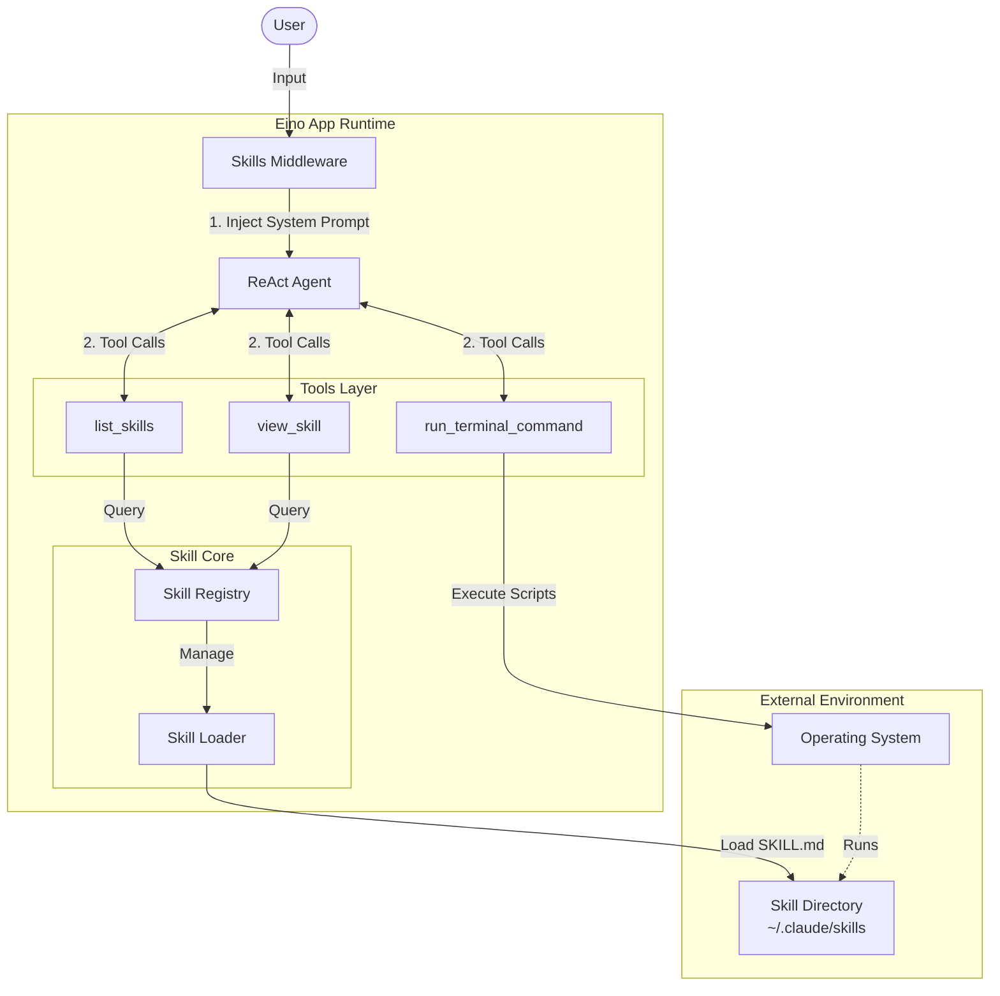
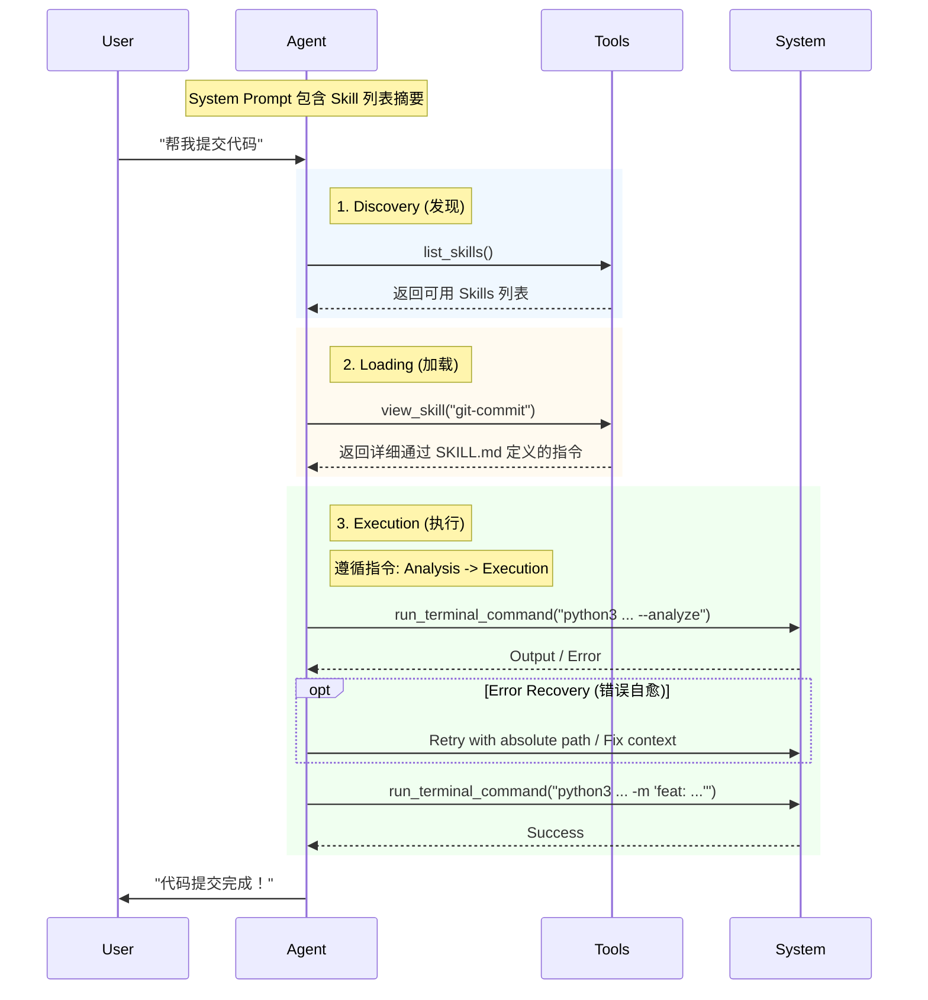

# Eino Skills - Claude Skills 集成方案

基于 [Anthropic Agent Skills](https://www.anthropic.com/engineering/equipping-agents-for-the-real-world-with-agent-skills) 和 [deepagents-cli](https://github.com/langchain-ai/deepagents/tree/master/libs/deepagents-cli) 的设计，为 [cloudwego/eino](https://github.com/cloudwego/eino) 框架实现 Skills 支持。

## 核心概念

### 什么是 Skills？

Skills 是包含 `SKILL.md` 文件的文件夹，提供：
- **渐进式披露 (Progressive Disclosure)**：只在需要时加载完整指令
- **Token 效率**：启动时仅加载元数据（name + description）
- **认知负担降低**：Agent 使用少量原子工具 + 按需加载的技能指令

### SKILL.md 结构

```yaml
---
name: skill-name
description: Brief description of what this skill does and when to use it
---

# Skill Name

## Instructions
[具体操作指令]

## Examples
[使用示例]
```

## 架构设计



### 执行流程



## 项目结构

```
eino-skills/
├── README.md
├── go.mod
├── pkg/
│   ├── skill/
│   │   ├── types.go            # Skill 类型定义
│   │   ├── loader.go           # Skills 加载器
│   │   ├── parser.go           # SKILL.md 解析器
│   │   └── registry.go         # Skills 注册中心
│   ├── tools/
│   │   ├── skills.go           # 工具包入口
│   │   ├── view_skill.go       # view_skill Tool
│   │   ├── list_skills.go      # list_skills Tool
│   │   └── run_terminal_command.go # 终端执行工具
│   └── middleware/
│       └── skills.go           # Skills 中间件
├── cmd/
│   ├── example/
│   │   └── main.go             # 完整 Agent 示例
│   └── eino-skills-cli/
│       └── main.go             # CLI 管理工具
```

## 快速开始

```go
package main

import (
    "context"
    "fmt"
    "os"
    
    // Eino 核心组件
    "github.com/cloudwego/eino-ext/components/model/claude"
    "github.com/cloudwego/eino/compose"
    "github.com/cloudwego/eino/flow/agent"
    "github.com/cloudwego/eino/flow/agent/react"
    "github.com/cloudwego/eino/schema"
    
    // Skills 相关包
    skillsmw "github.com/dyike/eino-skills/pkg/middleware"
    skillpkg "github.com/dyike/eino-skills/pkg/skill"
    skilltools "github.com/dyike/eino-skills/pkg/tools"
)

func main() {
    ctx := context.Background()
    
    // 1. 初始化 Skills (加载器 & 注册表)
    loader := skillpkg.NewLoader(
        skillpkg.WithGlobalSkillsDir("~/.claude/skills"), // 指向实际的 skills 目录
    )
    
    registry := skillpkg.NewRegistry(loader)
    if err := registry.Initialize(ctx); err != nil {
        panic(err)
    }
    
    // 2. 创建 Skills 中间件
    skillsMiddleware := skillsmw.NewSkillsMiddleware(registry)
    
    // 3. 准备 Tools (基础 Skill 工具 + 终端执行能力的工具)
    tools := skilltools.NewSkillTools(registry) // 包含 list_skills, view_skill
    cwd, _ := os.Getwd()
    tools = append(tools, skilltools.NewRunTerminalCommandTool(cwd))
    
    // 4. 配置 Chat Model (以 Claude 为例)
    baseURL := "http://127.0.0.1:8045" // 你的 Proxy 地址
    chatModel, err := claude.NewChatModel(ctx, &claude.Config{
        Model:     "claude-3-5-sonnet-20240620",
        APIKey:    os.Getenv("ANTHROPIC_API_KEY"), // 建议从环境变量获取
        BaseURL:   &baseURL,
        MaxTokens: 4096,
    })
    if err != nil {
        panic(err)
    }
    
    // 5. 注入 System Prompt (包含 Skills 使用规范)
    basePrompt := `You are a helpful AI assistant with access to specialized skills.
    
1. Use 'list_skills' to see what's available.
2. Use 'view_skill' to load detailed instructions.
3. Follow the skill's workflow strictly step-by-step.
4. Execute commands directly (no pre-checks like 'ls').
5. If a script fails, try to fix paths or fall back to native commands.`

    systemPrompt := skillsMiddleware.InjectPrompt(basePrompt)
    
    // 6. 创建 Agent
    myAgent, err := react.NewAgent(ctx, &react.AgentConfig{
        ToolCallingModel: chatModel,
        ToolsConfig: compose.ToolsNodeConfig{
            Tools: tools,
        },
        MaxStep: 50, // 增加步数限制以支持多步骤 Skill
    })
    if err != nil {
        panic(err)
    }
    
    // 7. 运行 Agent
    // 实际使用建议使用 Stream 模式
    resp, err := myAgent.Generate(ctx, []*schema.Message{
        {Role: schema.System, Content: systemPrompt},
        {Role: schema.User, Content: "帮我写一个 git commit message"},
    })
    
    if err != nil {
        fmt.Println("Error:", err)
        return
    }
    
    fmt.Println(resp.Content)
}
```

## Feature Roadmap

| Feature | Status | Description |
|---------|--------|-------------|
| 核心加载器/解析器 | ✅ | `loader.go`, `parser.go` - SKILL.md discovery & parsing |
| Registry & 缓存 | ✅ | `registry.go` - on-demand loading with mutex-protected cache |
| 中间件集成 | ✅ | `middleware/skills.go` - prompt injection & tool provisioning |
| CLI 管理工具 | ✅ | `eino-skills-cli` - list, create, view, validate commands |
| 热重载支持 | ✅ | `watcher.go` - fsnotify-based auto-reload on SKILL.md changes |
| Skills 市场 | 🚧 | Remote skill installation (planned) |
| allowed-tools 限制 | 🚧 | Restrict tool access per skill (planned) |
| 可视化调试 | 🚧 | Skill execution tracing UI (planned) |
| 版本管理 | 🚧 | Skill versioning & compatibility (planned) |
